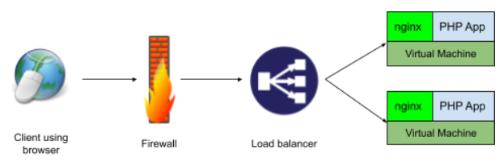
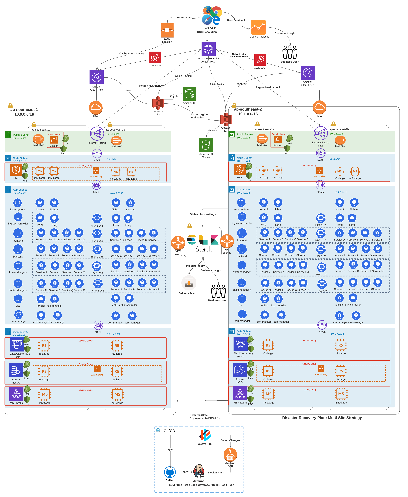

# 99co-technical-test
99.co DevOps Technical Test

# Part A
1. Tell us about your main motivation to pursue a career in the software industry!
2. Tell us about your strengths that help your profession as a software engineer and how do
you take advantage of them to become a better engineer!
3. Tell us about your weaknesses that give you challenges and what are your efforts to
overcome them!
4. Tell us about the most challenging project that you have worked on and what efforts or
strategies you use to solve the problems you met in that project!
5. Tell us about external factors that you would consider ideal to help you become a more
effective engineer!
6. Tell us about how you see yourself in the next five years in software industry!
7. What do you think about DevOps ?

# Part B
Part B
These are very simple technical questions to give us a bit overview on linux and computer network
skills.
1. When setting up a new website, the web can’t be accessed. On the Nginx error log returns
*/var/www/html/index.html is forbidden (13: Permission denied).*

Doing an ls -la on /var/www/html returns the following result:
```console
/var/www/html$ ls -al
total 12
drwxr-xr-x 2 root root 4096 Jul 8 09:47 .
drwxr-xr-x 3 root root 4096 Mei 29 11:27 ..
---------- 1 root root 612 Mei 29 11:27 index.html
```
Explain how you would solve this issue as detailed as you need it to be. Feel free to add
assumptions as needed.
**Answer:**
It is obvious that apache is lack of permission to read the index.html file.
The index.html is owned by root. It is not recommended settings.
It is likely that nginx doesnt belong to www-data group.
We can add nginx user to www-data group by issuing this command:
```console
sudo usermod -a -G www-data nginx
```
To verify that nginx is a part of www-data group, we can issue command:
```console
id nginx
```
It is recommended that the /var/www/html owner and file inside them to www-data group and user.
```console
sudo chown -R www-data:www-data /var/www/html
```
To align with the best practise, we should assign the 775 permission to the /var/www/html directory.
In numerical mode, 775 stands for
Owner:  7 - 111 - read, write, and execute
Group:  5 - 101 - read and execute
Others: 5 - 101 - read and execute.
Last but not least, /var/www/html/index.html must be assigned 644 permission
and 644 permission to the index.html which means
Owner:  6 - 110 - read and write,
Group:  4 - 101 - read only,
Others: 4 - 101 - read only.
We can accomplished those in one command line below:
```console
sudo chmod /var/www/html 775 && sudo 644 chmod /var/www/html/index.html
```
Eventually, we can assure that Nginx will no longer encounter *permission denied* issue and our solution have followed the best practises.

2. There’s a production database on server A that can only be accessed from server B. A
database engineer needs to access the database regularly on server A but only has the
permission to connect to server B. Explain how you would set the environment for the
database engineer to connect to server A. You can be as detailed as possible and use
assumptions for the information that’s not given here.

3. Assume we have setup a service with the following layers:
<p align="center">
  
</p>

When the client receives error **502 Bad Gateway** , how would you like to troubleshoot to fix
the issue to point out the root problem? You can be as detailed as possible and use
assumptions for the information that’s not given here.

# Part C
## Infrastructure Diagram
<p align="center">
  
</p>
Image Link: https://lucid.app/lucidchart/2237664e-6e48-4393-b33c-91216df6e8de/edit?viewport_loc=478%2C42%2C3328%2C1646%2C0_0&invitationId=inv_639fc3d3-d6ad-45d3-800e-a0f01f6a23bb