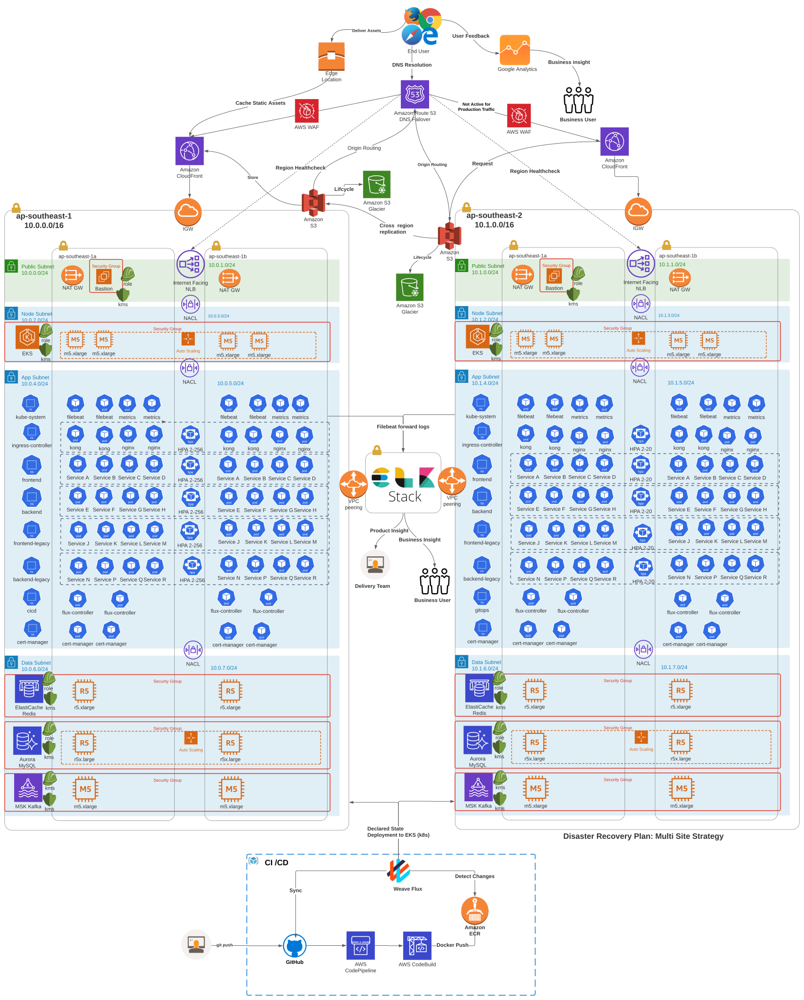

# 99c-technical-test
99.co DevOps Technical Test

# Part A
1. Tell us about your main motivation to pursue a career in the software industry!
**Answer:**
I always believe that IT software industry is the next big things today. 
2. Tell us about your strengths that help your profession as a software engineer and how do
you take advantage of them to become a better engineer!
**Answer:**
- I am a fast learner. I believe with good fundamentals, good logics, and english, I can learn almost anything. So I am never afraid to invest for Linked Learning, Cloud Guru for 1 year subscription.
- I am good team player. I love to share ideas, coaching my apprentice, and join the Tech communities. It allow me to learn new things, pick some lesson, get new insights
3. Tell us about your weaknesses that give you challenges and what are your efforts to
overcome them!
- Most of the time, I forget time when working to debug an error that I can't solved for days especialy when the error is not available in Stackoverflow. So, when I feel I am in a dead end. I try to ask to the community, trying to reread the documentation, and share the error to my co-worker and ask for assistance.
- I am quite perfectionist. 
4. Tell us about the most challenging project that you have worked on and what efforts or
strategies you use to solve the problems you met in that project!
- Axis Modernization: Network Readiness. In this project, I must establish connection between AWS and XL onpremise datacenter and provision them using Terraform. I had little knowledge on Onpremise network and still green at using Terraform at the time and yet I must deliver them in strict timeline (it is about 2 weeks). My stategy was to cut my learning curves using medium.com and some in AWS docs to learn about AWS Transit Gateway, AWS S2S VPN and AWS DirectConnect.. Fortunately, I found the right use case in medium.com to deliver my task and I can make it in 2 weeks.
5. Tell us about external factors that you would consider ideal to help you become a more
effective engineer!
- Good environment and team that is open-minded and love to embrance new ideas.
- Good role model in my workplace that can help me to grow better, adapt new mindset and new framework as well as new insights.
- Company business model. I love to work on a company that make serious impact to the society. It encourages me to give my best. 
6. Tell us about how you see yourself in the next five years in software industry!
- I would love to see myself as Head of Engineer in the next five years or at least as DevOps Lead. So I can design the company technology roadmap for product, app, and infrastructure that is really fit the business model and user demand as well as adapting to the latest tech and in-line with industry best practises.
7. What do you think about DevOps ?
- DevOps is a culture that break the silo between Ops and Development. DevOps isn't simply adopting agile, CI/CD, automation, even those practices are certainly important. For me, DevOps is all about a shared understanding between developers and ops, and share responsibility for the software we build. It means increasing collaboration and transparancy across development, Ops, and business. DevOPs allow us to deliver product fast. If we go fast we are very likely to break things but we will break small.

# Part B
Part B
These are very simple technical questions to give us a bit overview on linux and computer network
skills.
1. When setting up a new website, the web can’t be accessed. On the Nginx error log returns
*/var/www/html/index.html is forbidden (13: Permission denied).*

Doing an ls -la on /var/www/html returns the following result:
```console
/var/www/html$ ls -al
total 12
drwxr-xr-x 2 root root 4096 Jul 8 09:47 .
drwxr-xr-x 3 root root 4096 Mei 29 11:27 ..
---------- 1 root root 612 Mei 29 11:27 index.html
```
Explain how you would solve this issue as detailed as you need it to be. Feel free to add
assumptions as needed.
**Answer:**

It is obvious that apache is lack of permission to read the index.html file.
The index.html is owned by root. It is not recommended settings.
It is likely that nginx doesnt belong to www-data group.
We can add nginx user to www-data group by issuing this command:
```console
sudo usermod -a -G www-data nginx
```
To verify that nginx is a part of www-data group, we can issue command:
```console
id nginx
```
It is recommended that the /var/www/html and the file inside belong to *www-data* group and user.
```console
sudo chown -R www-data:www-data /var/www/html
```
To align with the best practise, we should assign the 775 permission to the /var/www/html directory.
In numerical mode, if we map the number to the binary, 775 would stands for
```
Owner:  7 - 111 - read, write, and execute
Group:  5 - 101 - read and execute
Others: 5 - 101 - read and execute
```
Last but not least, /var/www/html/index.html must be assigned 644 permission
and 644 permission to the index.html which means
```
Owner:  6 - 110 - read and write,
Group:  4 - 100 - read only,
Others: 4 - 100 - read only
```
We can accomplished those in one command line below:
```console
sudo chmod /var/www/html 775 && sudo 644 chmod /var/www/html/index.html
```
Eventually, we can assure that Nginx will no longer encounter *permission denied* issue and our solution have followed the best practises.

2. There’s a production database on server A that can only be accessed from server B. A
database engineer needs to access the database regularly on server A but only has the
permission to connect to server B. Explain how you would set the environment for the
database engineer to connect to server A. You can be as detailed as possible and use
assumptions for the information that’s not given here.

**Answer:**

**Assumption**

Let's assume that the production server is 
- running in the public cloud AWS, 
- Database is managed Amazon RDS and running in port 3306, 
- and database engineer client is using Linux or MacOs, 
- Organization VPN IP range is 206.189.38.216/29
- VPC CIDR 10.0.0.0/16, Public Subnet CIDR: 10.0.0.0/24, Private Subnet: 10.0.1.0/24
- We must setup the environment as secure as possible. Server B will act as Bastion host and it will be placed in public subnet that is routed to the internet gateway
- Server A itslef will be placed in private subnet that will be routed to NAT gateway, and NAT gateway itself is routed to the internet gateway. So server A can't be accessed outside, but can perform update/patch to the internet. 
- Server A must be secured as possible.

The proposed solution based on assumption is depicted below.
<p align="center">
  
</p>

* Setup Database engineer client to Server B.

A database engineer have access to server B means ,at least, he/she has SSH access to the production server.
However, we want the database engineer to establish secure connection to the server B.
Database engineer need his/her own SSH key using OpenSSH using *ssh-keygen*.
His/Her private key must be assign with *chmod 400 ~/.ssh/id_rsa* and then put his/her public key to the *~/.ssh/authorized_keys* in server B.

* Restrict IP access to the Server B

Due to server B is accessible through the internet, Server B access must be limited to spesific public IP range that belong to the organization/company. As we assume that the server is running in the cloud, we can restrict the access to the server B using security group (firewall) to only allow inbound rule TCP 22 and 206.189.38.216/29.

* Server B access to the Server A (Production DB)

If Server A is our self-hosted MySQL database. We can allow Server B private IP to access TCP 22 to server A, but server A can be accessed with TCP 3306 (MySQL Port) from the internal network or VPC (Virtual Private Cloud) so the application can access the Server A.
As we assumed that the server A is managed database Amazon RDS. It is pretty unlikely that managed database allow SSH access the instance. So we must only allow the TCP 3306 open to the internal network or VPC.

* Secure database server A in transit and at rest.

As we know that, threat doesnt come not only from outside the organization, but it come come from inside such as internal malicious actor. So
we must secure our production DB both in transit and at rest. Our Database connection must enforce SSL/TLS to encrypt our connection to Production database. 
```console
mysql -u <DB_USER> -h <DB_HOST> -P 3306 –ssl-ca=~/ssl-client/ca.pem –ssl-cert=~/ssl-client/client-cert.pem –ssl-key=~/ssl-client/client-key.pem -p<DB_PASS>
```
We must also encrypt our database storage using KMS (key management service).

3. Assume we have setup a service with the following layers:
<p align="center">
  
</p>

When the client receives error **502 Bad Gateway** , how would you like to troubleshoot to fix
the issue to point out the root problem? You can be as detailed as possible and use
assumptions for the information that’s not given here.

**Answer:**

**Assumption**
- The solution diagram proposed is deployed in AWS
- The firewall is using AWS Security Group
- PHP application is running on port 8080
- Virtual machine is running Ubuntu OS.

We can actually print the nginx log to figure out the problem by issuing this command:

```console
sudo tail -30 /var/log/nginx/error.log
```
However, let us identify the problem in every layer that might exist:

**Firewall**
- If the php application port behind nginx load balancer is blocked by the firewall security group. It is likely the nginx will throw an error
So, the security group inbound role must allow TCP 8080 to the load balancer.

**Nginx Configuration**
- Nginx configuration must proxy pass *http://localhost:8080/* 
we can check the nginx default configuration by issuing the command:
```console
sudo cat /etc/nginx/sites-enabled/default
```
Let's assume that the configuration output would be like this.
```nginx
server {
    listen 80 default_server;
    listen [::]:80 default_server;

    root /var/www/html
    index index.php index.html;
    server_name _;
    location / {
      proxy_set_header X-Request-Id $request_id;
      proxy_set_header X-Forwarded-For $proxy_add_x_forwarded_for;
      proxy_set_header X-Real-IP $remote_addr;
      proxy_set_header X-Forwarded-Proto $scheme;
      proxy_set_header Host $host;
      proxy_pass http://localhost:8080/;
    }
}
```
**PHP Backend Service**
- If the backend service failed, Nginx will not received any data from it. It will result the 502 bad gateway because nginx is depend on backend service. We can restart the application to make the application work by issuing the following command.

```console
 kill -9 $(pgrep php-fpm)
 service php7-fpm restart
```

# Part C

This part helps us to understand how you would design and build a scalable system that could
serve millions of users per month.

<p align="center">
  
</p>

Let’s imagine we are going to build a Restful API system that can be accessed securely from the
public, fast enough to respond with sufficient body size, and minimum down time (SLA 99.9%).
The system also will use common relational databases (such as MySQL, PostgreSQL). With those
conditions, tell us:

- how you would design the system given the requirements
- what technologies (open source or 3rd party) you are going to use
- how you would setup the deployment and namespacing strategy for each repo (1 colour is
1 repo, so there are 4 repos on the diagram); and
- the strategy/approach that you are going to use to handle high usage but keep the system
reaching uptime 99.9%.

Assume your solution is set up on Kubernetes in AWS EKS (don’t set up the
solution on real infrastructure by the way!!!). You can use diagrams to help illustrate your
explanation. Feel free to add assumptions.

**Answer:**
# Technology Stack
- AWS for public cloud
- All our services will use docker container both backend and frontend.
- Kubernetes for Container orchestration
- Helm for kubernetes deployment
- Our Docker registry will use Amazon ECR.
- Github for SCM, and AWS Codepipeline with AWS Codebuild to build our containerized application, tag, and push them to Docke Registry
- Weave Flux for CD that is aligned with GitOps principle
- ElasticCloud for Observability such as realtime monitoring, analytics, APM, and logging.

**Assumption**

- The solution is deployed on AWS
- Backend service is using golang and PHP
- Frontend service is using reactjs
- FrontEnd Service J, K, L, M and Backend service N, P, Q, R is legacy service because not leveraging API gateway.

# Infrastructure Diagram
Here's diagram for the propposed solution
<p align="center">
  
</p>
Image Link: https://lucid.app/lucidchart/2237664e-6e48-4393-b33c-91216df6e8de/edit?viewport_loc=478%2C42%2C3328%2C1646%2C0_0&invitationId=inv_639fc3d3-d6ad-45d3-800e-a0f01f6a23bb

# Summary
Based what have been designed on the diagram.
- The infrastructure is deployed in AWS ap-southeast-1 region
- Application, Redis, MySQL Database, and Kafka workload are deployed in two availability zones ap-southeast-1a and ap-southeast-1b to provide high availability, and fault tolerance
- All our infrastructure is designed elastically. The infrastructure will scale seamlessly should the bussiness perform such as massive ads that bring high traffics from million users.
- The infrastructure is designed for Disaster Recovery Plan with Multi Site Strategy. Thus, Region-wide failure will keep our application up. Our Route53 Healthcheck will make sure our application uptime reach 99.999%.
- The Infrastructure adopt naming standardization for all our cloud resources using
  - var.unit = It represent the business unit code e.g 99c (99.co)
  - var.code = it represent the service domain code e.g service
  - var.feature = it represent the service domain feature e.g e, f, g, h, etc
  - var.env = it represent the our staging environment.
- We have secured all of our infrastructure to encrypt data in transit using SSL/TLS, and at rest using AWS KMS to encrypt our storages such as block(EBS) and object storages (S3)
- Kubernetes microservice is also implemented Horizontal Pod Autoscaler with minimum 2 and maximum 256 pod and will distributed in two AZs.
- Our kubernetes also will deploy Kong as ingress controller. By doing that, we can leverage Kong API gateway and its plugin for authentication in API gateway, rate limited, Geo IP restriction, etc.
- Our infrastructure and application will use ElasticCloud for observability. We will deploy filebeat as log aggregator and metricbeats as Daemon set. Filebeat will forward our log to Logstash. Logstash will parse our STDOUT using Grok Pattern to Elastic Document JSON to store in Elastic Search. So, we can query our them using Kibana to create Insightful Dashboard. We also will deployed APM Server to our EKS cluster.
- Our Continous Integration will leverage Github as SCM, AWS Codepipeline and AWS Codebuild for Continous delivery to produce docker images and push to ECR
- We will implement the Gitops for our continous delivery (Pull Model) using Flux. Flux will read our helm manifest that is stored on Github as the single source of truth. Flux will deployed desired state from Git to the actual state (k8s). It can also detect drift that will restore our actual state to the desired sate on git.

# Infrastructure Deployment
All our infrastructure will be deployed using Terraform. To aligh with GitOps princle, We will leverage Atlantis as Terraform CI/CD. As we use Weave Flux for Application deployment, git will be the source of truth.

Atlantis will detect any changes for adding new resources.
Here is the sample configuration for atlantis.yaml. Atlantis will detect changes on directory that is listed her in every Pull Request.
```yaml
version: 3
projects:
  - dir: service-deployment/99c-service-e
    apply_requirements: ["approved","mergeable"]
    autoplan:
      when_modified: ["*.tf*"]
      enabled: true
  - dir: service-deployment/99c-service-f
    apply_requirements: ["approved","mergeable"]
    autoplan:
      when_modified: ["*.tf*"]
      enabled: true
  - dir: service-deployment/99c-service-g
    apply_requirements: ["approved","mergeable"]
    autoplan:
      when_modified: ["*.tf*"]
      enabled: true
  - dir: service-deployment/99c-service-h
    apply_requirements: ["approved","mergeable"]
    autoplan:
      when_modified: ["*.tf*"]
      enabled: true
  - dir: cloud-deployment/vpc
    apply_requirements: ["approved","mergeable"]
    autoplan:
      when_modified: ["*.tf*"]
      enabled: true
  - dir: cloud-deployment/eks
    apply_requirements: ["approved","mergeable"]
    autoplan:
      when_modified: ["*.tf*"]
      enabled: true
  - dir: cloud-deployment/elasticache
    apply_requirements: ["approved","mergeable"]
    autoplan:
      when_modified: ["*.tf*"]
      enabled: true
  - dir: cloud-deployment/rds
    apply_requirements: ["approved","mergeable"]
    autoplan:
      when_modified: ["*.tf*"]
      enabled: true
```
All cloud and service deployment will invoke from terraform module that we create in module directory.
It is an example for adding CLoud deployment Amazon Elastic Kubernetes Service.

```yaml
- dir: cloud-deployment/eks
    apply_requirements: ["approved","mergeable"]
    autoplan:
      when_modified: ["*.tf*"]
      enabled: true
```
If we want to add new service, we can add this line below:
```yaml
- dir: service-deployment/99c-service-e
    apply_requirements: ["approved","mergeable"]
    autoplan:
      when_modified: ["*.tf*"]
      enabled: true
```

Service deployment will automatically provision the service Docker Registry ECR, CI/CD Codepipeline, Codebuild, etc.
If developer want to add new services for example. Developer will need to clone the terraform code. Add new atlantis config in atlantis.yaml. Furthermore, they will need to make PR request with Jira ticket as their branch name e.g OPS-001.
Atlantis will automatically will print the terraform plan for our new infra and services.
DevOps team then will review the changes on their Pull Request. After DevOps team approved the PR. Developer can then comment atlantis apply to apply the plan.
Unlike Weave Flux, Atlantis can revert the actual state to desired state based on Github if we perform infrastructure changes outside atlantis.

# Network
Here's our infrastructure terraform  for our AWS network.
Our VPC CIDR will use: **10.0.0.0/16**
The subnet CIDR will be derived using Terraform function
```terraform
cidr_block        = cidrsubnet(aws_vpc.vpc.cidr_block, 8, count.index + 1 * (length(data.aws_availability_zones.az.names)-1))
```
to generate **10.0.x.0/24 subnet CIDR block equally for public, node, app, and data nodes equally.
We also have configured the routing to NAT and Internet Gateway.
- Our kubernetes node worker be placed in node subnet
- Our kubernetes app (pod) will be placed in app subnet
- Last but not least, our Amazon Aurora MySQL, Elasticache Redis, and Our MSK Kafka will be placed in data subnet accordingly.
- Our subnet will span for two Availability Zones to provide High Availability and Fault Tolerance.

# Network Terraform Modular codes
It contains the terraform code for module and cloud deployment
## Network Module
All the code on network modules. This module will be invoke for cloud network deployment
**modules/network/variables.tf**
```terraform

**modules/network/vpc.tf**
```terraform
resource "aws_vpc" "vpc" {
  cidr_block = var.vpc_cidr
  enable_dns_support = var.enable_dns_support
  enable_dns_hostnames = var.enable_dns_hostnames
  tags = {
    "Name"    = "${var.unit}-${var.env}-${var.code}-${var.feature[0]}"
    "Env"     = var.env
    "Code"    = var.code
    "Feature" = var.feature[0]
    "Creator" = var.creator
  }
}
```
**modules/network/subnet.tf**
```terraform
data "aws_availability_zones" "az" {
  state = "available"
}

resource "aws_subnet" "public" {
  count             = length(data.aws_availability_zones.az.names) - 1
  vpc_id            = aws_vpc.vpc.id
  cidr_block        = cidrsubnet(aws_vpc.vpc.cidr_block, 8, count.index + 0 * (length(data.aws_availability_zones.az.names)-1))
  availability_zone = element(data.aws_availability_zones.az.names, count.index)
  tags = {
    "Name"    = "${var.unit}-${var.env}-${var.code}-${var.feature}-${var.sub[1]}-public-${element(data.aws_availability_zones.az.names, count.index)}"
    "Env"     = var.env
    "Code"    = var.code
    "Feature" = "subnet"
    "Sub"     = "${var.sub[1]}-public"
    "Zones"   = element(data.aws_availability_zones.az.names, count.index)
  }
}

resource "aws_subnet" "node" {
  count             = length(data.aws_availability_zones.az.names) - 1
  vpc_id            = aws_vpc.vpc.id
  cidr_block        = cidrsubnet(aws_vpc.vpc.cidr_block, 8, count.index + 1 * (length(data.aws_availability_zones.az.names)-1))
  availability_zone = element(data.aws_availability_zones.az.names, count.index)
  tags = {
    "Name"                                                  = "${var.unit}-${var.env}-network-subnet-node-${element(data.aws_availability_zones.az.names, count.index)}"
    "Env"                                                   = var.env
    "Code"                                                  = var.code
    "Feature"                                               = "subnet"
    "Sub"                                                   = "node"
    "Zones"                                                 = element(data.aws_availability_zones.az.names, count.index)
    "kubernetes.io/cluster/${aws_eks_cluster.cluster.name}" = "${var.unit}-${var.env}-${var.code}-${var.feature}-${var.sub[0]}"
  }
}

resource "aws_subnet" "app" {
  count             = length(data.aws_availability_zones.az.names) - 1
  vpc_id            = aws_vpc.vpc.id
  cidr_block        = cidrsubnet(aws_vpc.vpc.cidr_block, 8, count.index + 2 * (length(data.aws_availability_zones.az.names)-1))
  availability_zone = element(data.aws_availability_zones.az.names, count.index)
  tags = {
    "Name"    = "${var.unit}-${var.env}-${var.code}-${var.feature}-${var.sub[1]}-app-${element(data.aws_availability_zones.az.names, count.index)}"
    "Env"     = var.env
    "Code"    = var.code
    "Feature" = var.feature
    "Sub"     = "${var.sub[1]}-app"
    "Zones"   = element(data.aws_availability_zones.az.names, count.index)
  }
}

resource "aws_subnet" "data" {
  count             = length(data.aws_availability_zones.az.names) - 1
  vpc_id            = aws_vpc.vpc.id
  cidr_block        = cidrsubnet(aws_vpc.vpc.cidr_block, 8, count.index + 3 * (length(data.aws_availability_zones.az.names)-1))
  availability_zone = element(data.aws_availability_zones.az.names, count.index)
  tags = {
    "Name"    = "${var.unit}-${var.env}-${var.code}-${var.feature}-${var.sub[1]}-data-${element(data.aws_availability_zones.az.names, count.index)}"
    "Env"     = var.env
    "Code"    = var.code
    "Feature" = var.feature
    "Sub"     = "${var.sub[1]}-data"
    "Zones"   = element(data.aws_availability_zones.az.names, count.index)
  }
}
```

**modules/network/igw.tf**
```terraform
resource "aws_internet_gateway" "igw" {
  vpc_id   = aws_vpc.vpc.id

  tags = {
    "Name" = "${var.unit}-${var.env}-${var.code}-${var.feature[2]}"
    "Env"     = var.env
    "Code"    = var.code
    "Feature" = var.feature[2]
    "Creator" = var.creator
  }
}
```

**modules/network/nat.tf**
```terraform
resource "aws_eip" "eip" {
  count = var.total_eip
  vpc   = true

  tags = {
    "Name"    = "${var.unit}-${var.env}-${var.code}-${var.feature[3]}-${count.index}"
    "Env"     = var.env
    "Code"    = var.code
    "Feature" = var.feature[3]
    "Creator" = var.creator
  }
}

resource "aws_nat_gateway" "nat" {
  count         = length(aws_subnet.public_subnet)
  allocation_id = element(aws_eip.eip.*.id, count.index)
  subnet_id     = element(aws_subnet.public_subnet.*.id, count.index)

  tags = {
    "Name"    = "${var.unit}-${var.env}-${var.code}-${var.feature[4]}-${element(data.aws_availability_zones.az.names, count.index)}"
    "Env"     = var.env
    "Code"    = var.code
    "Feature" = var.feature[4]
    "Creator" = var.creator
    "Zones"   = element(data.aws_availability_zones.az.names, count.index)
  }
}
```

**modules/network/route.tf**
```terraform
#Public Route Table
resource "aws_route_table" "public_rt" {
  vpc_id = aws_vpc.vpc.id

  route {
    cidr_block = "0.0.0.0/0"
    gateway_id = aws_internet_gateway.igw.id
  }

  tags = {
    "Name"    = "${var.unit}-${var.env}-${var.code}-${var.feature[5]}-public"
    "Env"     = var.env
    "Code"    = var.code
    "Feature" = var.feature[5]
    "Creator" = var.creator
  }
}

resource "aws_route_table_association" "public_rta" {
  count          = length(aws_subnet.public_subnet)
  subnet_id      = element(aws_subnet.public_subnet.*.id, count.index)
  route_table_id = aws_route_table.public_rt.id
}

#App Route Table
resource "aws_route_table" "app_rt" {
  count    = length(aws_subnet.app_subnet)
  vpc_id = aws_vpc.vpc.id

  route {
    cidr_block = "0.0.0.0/0"
    gateway_id = element(aws_nat_gateway.nat.*.id, count.index)
  }

  tags = {
    "Name"    = "${var.unit}-${var.env}-${var.code}-${var.feature[5]}-app"
    "Env"     = var.env
    "Code"    = var.code
    "Feature" = var.feature[5]
    "Creator" = var.creator
  }
}

resource "aws_route_table_association" "app_rta" {
  count          = length(aws_subnet.app_subnet)
  subnet_id      = element(aws_subnet.app_subnet.*.id, count.index)
  route_table_id = element(aws_route_table.app_rt.*.id, count.index)
}

resource "aws_route_table_association" "cache_rta" {
  count          = length(aws_subnet.cache_subnet)
  subnet_id      = element(aws_subnet.cache_subnet.*.id, count.index)
  route_table_id = element(aws_route_table.cache_rt.*.id, count.index)
}

#Database Route Table
resource "aws_route_table" "data_rt" {
  count    = length(aws_subnet.db_subnet)
  vpc_id = aws_vpc.vpc.id

  route {
    cidr_block = "0.0.0.0/0"
    gateway_id = element(aws_nat_gateway.nat.*.id, count.index)
  }

  tags = {
    "Name"    = "${var.unit}-${var.env}-${var.code}-${var.feature[5]}-data"
    "Env"     = var.env
    "Code"    = var.code
    "Feature" = var.feature[5]
    "Creator" = var.creator
  }
}

resource "aws_route_table_association" "data_rta" {
  count          = length(aws_subnet.db_subnet)
  subnet_id      = element(aws_subnet.db_subnet.*.id, count.index)
  route_table_id = element(aws_route_table.db_rt.*.id, count.index)
}
```

## Cloud Deployment: Network. 
The module code above then will be invoked in Cloud Deployment - Network
```terraform
module "vpc" {
  source               = "../../modules/network"
  region               = "ap-southeast-1"
  unit                 = "99c"
  env                  = "prd"
  code                 = "network"
  feature              = "vpc"
  sub                  = ["main", "subnet", "nat-gw", "igw", "rt"]
  creator              = "tf"
  vpc_cidr             = "10.0.0.0/16"
  enable_dns_support   = true
  enable_dns_hostnames = true
}
```

# EKS Terraform Modules codes
It contains the terraform code for module and cloud deployment
## EKS Module
The terraform code is based on our infrastructure diagram. In this code, we have implemented Node autoscaling with minimum 4 nodes and maximumm 256 nodes. It will scale should the business perform when running massive ads. Our EKS infrastructure will guarantee SLA 99.9% from our infrastructure deisgn.

**modules/compute/eks/eks.tf**
```terraform
resource "aws_iam_role" "eks_role" {
  name = "${var.unit}-${var.env}-${var.code}-${var.feature}-${var.sub[0]}-role"

  assume_role_policy = <<POLICY
{
  "Version": "2012-10-17",
  "Statement": [
    {
      "Effect": "Allow",
      "Principal": {
        "Service": "eks.amazonaws.com"
      },
      "Action": "sts:AssumeRole"
    }
  ]
}
POLICY
}

resource "aws_iam_role_policy_attachment" "eks_cluster_attachment" {
  policy_arn = "arn:aws:iam::aws:policy/AmazonEKSClusterPolicy"
  role       = aws_iam_role.eks_role.name
}

# Optionally, enable Security Groups for Pods
# Reference: https://docs.aws.amazon.com/eks/latest/userguide/security-groups-for-pods.html
resource "aws_iam_role_policy_attachment" "eks_pods_sg_attachment" {
  policy_arn = "arn:aws:iam::aws:policy/AmazonEKSVPCResourceController"
  role       = aws_iam_role.eks_role.name
}

resource "aws_eks_cluster" "cluster" {
  name     = "${var.unit}-${var.env}-${var.code}-${var.feature}-${var.sub[0]}"
  role_arn = aws_iam_role.eks_role.arn

  vpc_config {
    subnet_ids = data.terraform_remote_state.network.outputs.network_app_subnet_id
  }

  # Ensure that IAM Role permissions are created before and deleted after EKS Cluster handling.
  # Otherwise, EKS will not be able to properly delete EKS managed EC2 infrastructure such as Security Groups.
  depends_on = [
    aws_iam_role_policy_attachment.eks_cluster_attachment,
    aws_iam_role_policy_attachment.eks_pods_sg_attachment,
  ]
}
```

**modules/compute/eks/node-groups.tf**
Our node group is for on-demand. We can also setup new nodegroup using Spot for Cost optimization.
```terraform
resource "aws_iam_role" "node_role" {
  name = "${var.unit}-${var.env}-${var.code}-${var.feature}-${var.sub[1]}-role"

  assume_role_policy = jsonencode({
    Statement = [{
      Action = "sts:AssumeRole"
      Effect = "Allow"
      Principal = {
        Service = "ec2.amazonaws.com"
      }
    }]
    Version = "2012-10-17"
  })
}

resource "aws_iam_role_policy_attachment" "eks_node_policy" {
  policy_arn = "arn:aws:iam::aws:policy/AmazonEKSWorkerNodePolicy"
  role       = aws_iam_role.node_role.name
}

resource "aws_iam_role_policy_attachment" "eks_cni_policy" {
  policy_arn = "arn:aws:iam::aws:policy/AmazonEKS_CNI_Policy"
  role       = aws_iam_role.node_role.name
}

resource "aws_iam_role_policy_attachment" "eks_ecr_policy_readonly" {
  policy_arn = "arn:aws:iam::aws:policy/AmazonEC2ContainerRegistryReadOnly"
  role       = aws_iam_role.node_role.name
}

resource "aws_eks_node_group" "ondemand" {
  cluster_name    = aws_eks_cluster.cluster.name
  node_group_name = "${var.unit}-${var.env}-${var.code}-${var.feature}-${var.sub[1]}"
  node_role_arn   = aws_iam_role.node_role.arn
  subnet_ids      = data.terraform_remote_state.network.outputs.network_app_subnet_id
  scaling_config {
    desired_size = 4
    max_size     = 32
    min_size     = 4
  }

  update_config {
    max_unavailable = 2
  }

  # Ensure that IAM Role permissions are created before and deleted after EKS Node Group handling.
  # Otherwise, EKS will not be able to properly delete EC2 Instances and Elastic Network Interfaces.
  depends_on = [
    aws_iam_role_policy_attachment.eks_node_policy,
    aws_iam_role_policy_attachment.eks_cni_policy,
    aws_iam_role_policy_attachment.eks_ecr_policy_readonly,
  ]
}
```

**cloud_deployment/eks/main.tf**
Here's the implementation using module EKS.
```terraform
module "eks" {
  source                           = "../../modules/compute/ecs"
  region                           = "ap-southeast-1"
  unit                             = "99c"
  env                              = "prd"
  code                             = "compute"
  feature                          = ["eks"]
}
```

# Toolchain Deployment
After kubernetes cluster is provisioned. It will automatically all the toolchain such as Flux, Kong, Nginx, etc

# Flux Installation in Kubernetes

**modules/flux/fluxs.tf
```terraform
provider "kubernetes" {
  host  = data.terraform_remote_state.k8s.outputs.do_k8s_endpoint
  token = data.terraform_remote_state.k8s.outputs.do_k8s_kubeconfig0.token
  cluster_ca_certificate = base64decode(
    data.terraform_remote_state.k8s.outputs.do_k8s_kubeconfig0.cluster_ca_certificate
  )
}

provider "kubectl" {}

data "flux_install" "main" {
  target_path = var.target_path
}

data "flux_sync" "main" {
  target_path = var.target_path
  url         = var.github_url
  branch      = var.branch
}

# Kubernetes
resource "kubernetes_namespace" "flux_system" {
  metadata {
    name = "flux-system"
  }

  lifecycle {
    ignore_changes = [
      metadata[0].labels,
    ]
  }
}

data "kubectl_file_documents" "install" {
  content = data.flux_install.main.content
}

data "kubectl_file_documents" "sync" {
  content = data.flux_sync.main.content
}

locals {
  install = [for v in data.kubectl_file_documents.install.documents : {
    data : yamldecode(v)
    content : v
    }
  ]
  sync = [for v in data.kubectl_file_documents.sync.documents : {
    data : yamldecode(v)
    content : v
    }
  ]
}

resource "kubectl_manifest" "install" {
  for_each   = { for v in local.install : lower(join("/", compact([v.data.apiVersion, v.data.kind, lookup(v.data.metadata, "namespace", ""), v.data.metadata.name]))) => v.content }
  depends_on = [kubernetes_namespace.flux_system]
  yaml_body  = each.value
}

resource "kubectl_manifest" "sync" {
  for_each   = { for v in local.sync : lower(join("/", compact([v.data.apiVersion, v.data.kind, lookup(v.data.metadata, "namespace", ""), v.data.metadata.name]))) => v.content }
  depends_on = [kubernetes_namespace.flux_system]
  yaml_body  = each.value
}

resource "kubernetes_secret" "main" {
  depends_on = [kubectl_manifest.install]

  metadata {
    name      = data.flux_sync.main.secret
    namespace = data.flux_sync.main.namespace
  }

  data = {
    identity       = tls_private_key.main.private_key_pem
    "identity.pub" = tls_private_key.main.public_key_pem
    known_hosts    = local.known_hosts
  }
}

# GitHub
resource "github_repository" "main" {
  name       = "helm-repository"
  visibility = "public"
  auto_init  = true
}

resource "github_branch_default" "main" {
  repository = github_repository.main.name
  branch     = "main"
}

resource "github_repository_deploy_key" "main" {
  title      = "production-cluster"
  repository = github_repository.main.name
  key        = tls_private_key.main.public_key_openssh
  read_only  = true
}

resource "github_repository_file" "install" {
  repository = github_repository.main.name
  file       = data.flux_install.main.path
  content    = data.flux_install.main.content
  branch     = "main"
}

resource "github_repository_file" "sync" {
  repository = github_repository.main.name
  file       = data.flux_sync.main.path
  content    = data.flux_sync.main.content
  branch     = "main"
}
```

**toolchain-deployment/flux/main.tf**
```terraform
terraform {
  backend "s3" {
    bucket  = "99c-prd-storage-s3-terraform"
    region  = "ap-southeast-1"
    key     = "99c-compute-flux-prd.tfstate"
    profile = "99c-prd"
  }
}

module "flux" {
  source    = "../../modules/flux"
  namespace = "flux-system"
  github_url = "ssh://git@github.com/99c/99c-toolchain-flux.git"
}
```

# Amazon RDS: MySQL
Our Aurora MySQL is 5x times performance compared to general MySQL engine. It also has been designed elastically, so it can scale elastically should the business perform. We have implement AWS App Autoscaling for Aurora RDS Read Replica.
Our database production also have been secured in transit using SQL so the application is enforced to use SSL connection and at rest using KMS to encrpyt the storages. Our database can only be accessed from internal VPC network.

**modules/compute/rds/aurora.tf**
```terraform
resource "aws_security_group" "sg" {
  name        = "${var.unit}-${var.env}-${var.code}-${var.feature}-sg"
  description = "Security Group for ${var.unit}-${var.env}-${var.code}-${var.feature}"
  vpc_id      = data.terraform_remote_state.network.outputs.network_vpc_id
  tags = {
    Name      = "${var.unit}-${var.env}-${var.code}-${var.feature}-sg"
    "Env"     = var.env
    "Code"    = var.code
    "Feature" = var.feature
  }
}

resource "aws_security_group_rule" "sg_in_tcp" {
  type              = "ingress"
  from_port         = 3306
  to_port           = 3306
  protocol          = "tcp"
  cidr_blocks       = [aws.vpc.cidr_blocks]
  security_group_id = aws_security_group.sg.id
  description       = "Allow ingress TCP 3306 for ${var.unit}-${var.env}-${var.code}-${var.feature}"
}

resource "aws_security_group_rule" "sg_eg_all" {
  type              = "egress"
  from_port         = 0
  to_port           = 0
  protocol          = "-1"
  cidr_blocks       = ["0.0.0.0/0"]
  security_group_id = aws_security_group.sg.id
  description       = "Allow egress all protocol ${var.unit}-${var.env}-${var.code}-${var.feature}"
}

data "terraform_remote_state" "network" {
  backend = "s3"
  config = {
    bucket  = "${var.unit}-${var.env}-storage-s3-terraform"
    key     = "${var.unit}-network-${var.env}.tfstate"
    region  = var.region
    profile = "${var.unit}-${var.env}"
  }
}

resource "aws_db_subnet_group" "db_subnet_group" {
  name        = "${var.unit}-${var.env}-${var.code}-${var.feature}-db-subnet-group"
  subnet_ids  = data.terraform_remote_state.network.outputs.network_db_subnet_id
  description = "DB subnet group for ${var.unit}-${var.env}-${var.code}-${var.feature}"
  tags = {
    "Name"    = "${var.unit}-${var.env}-${var.code}-${var.feature}-db-subnet-group"
    "Env"     = var.env
    "Code"    = var.code
    "Feature" = var.feature
  }
}

data "terraform_remote_state" "kms" {
  backend = "s3"
  config = {
    bucket  = "${var.unit}-${var.env}-storage-s3-terraform"
    key     = "${var.unit}-security-kms-${var.env}.tfstate"
    region  = var.region
    profile = "${var.unit}-${var.env}"
  }
}

resource "random_password" "aurora_password" {
  length           = 16
  upper            = true
  lower            = true
  number           = true
  special          = false
  override_special = "_~!#$&*="
  min_lower        = 2
  min_upper        = 2
  min_special      = 0
  min_numeric      = 2
}

resource "aws_rds_cluster" "aurora_cluster" {
  cluster_identifier                  = "${var.unit}-${var.env}-${var.code}-${var.feature}-cluster-${var.region}"
  engine_mode                         = "provisioned"
  engine                              = "aurora-mysql"
  engine_version                      = "5.7.mysql_aurora.2.10.0"
  availability_zones                  = [data.aws_availability_zones.az.names[0], data.aws_availability_zones.az.names[1]]
  master_username                     = "root"
  master_password                     = random_password.aurora_password.result
  port                                = 3306
  db_subnet_group_name                = aws_db_subnet_group.db_subnet_group.name
  vpc_security_group_ids              = [aws_security_group.sg.id]
  iam_database_authentication_enabled = false
  db_cluster_parameter_group_name     = aws_rds_cluster_parameter_group.cluster_parameter_group.id
  backup_retention_period             = 5
  copy_tags_to_snapshot               = true
  storage_encrypted                   = true
  kms_key_id                          = data.terraform_remote_state.kms.outputs.kms_key_arn
  backtrack_window                    = 0
  allow_major_version_upgrade         = true
  enabled_cloudwatch_logs_exports     = ["error", "general", "slowquery"]
  preferred_backup_window             = "07:00-09:00"
  deletion_protection                 = true
  apply_immediately                   = true
  skip_final_snapshot                 = false
  final_snapshot_identifier           = "${var.unit}-${var.env}-${var.code}-${var.feature}-final-snapshot"
  tags = {
    "Name"    = "${var.unit}-${var.env}-${var.code}-${var.feature}-cluster"
    "Env"     = var.env
    "Code"    = var.code
    "Feature" = var.feature
  }
  lifecycle {
    prevent_destroy = true
    ignore_changes = [
      engine_version
    ]
  }
}

resource "aws_iam_role" "monitoring_role" {
  name = "${var.unit}-${var.env}-${var.code}-${var.feature}-monitoring-role"
  assume_role_policy = jsonencode({
    Version = "2012-10-17"
    Statement = [
      {
        Action = "sts:AssumeRole"
        Effect = "Allow"
        Sid    = ""
        Principal = {
          Service = "monitoring.rds.amazonaws.com"
        }
      },
    ]
  })
}

resource "aws_iam_role_policy_attachment" "monitoring_attach_policy" {
  role       = aws_iam_role.monitoring_role.name
  policy_arn = "arn:aws:iam::aws:policy/service-role/AmazonRDSEnhancedMonitoringRole"
}

resource "aws_rds_cluster_instance" "aurora_instances" {
  count                           = 2
  identifier                      = "${var.unit}-${var.env}-${var.code}-${var.feature}-instance-${element(data.aws_availability_zones.az.names, count.index)}-${count.index}"
  cluster_identifier              = aws_rds_cluster.aurora_cluster.id
  instance_class                  = "db.r5.xlarge"
  engine                          = aws_rds_cluster.aurora_cluster.engine
  engine_version                  = aws_rds_cluster.aurora_cluster.engine_version
  db_parameter_group_name         = aws_db_parameter_group.db_parameter_group.id
  publicly_accessible             = false
  copy_tags_to_snapshot           = aws_rds_cluster.aurora_cluster.copy_tags_to_snapshot
  promotion_tier                  = count.index
  availability_zone               = element(data.aws_availability_zones.az.names, count.index)
  performance_insights_enabled    = true
  performance_insights_kms_key_id = data.terraform_remote_state.kms.outputs.kms_key_arn
  monitoring_interval             = 60
  monitoring_role_arn             = aws_iam_role.monitoring_role.arn
  auto_minor_version_upgrade      = true
  apply_immediately               = true
  ca_cert_identifier              = "rds-ca-2019"
  tags = {
    "Name"    = "${var.unit}-${var.env}-${var.code}-${var.feature}-instance-${element(data.aws_availability_zones.az.names, count.index)}-${count.index}"
    "Env"     = var.env
    "Code"    = var.code
    "Feature" = var.feature
  }
}

resource "aws_appautoscaling_target" "autoscaling_target" {
  service_namespace  = "rds"
  scalable_dimension = "rds:cluster:ReadReplicaCount"
  resource_id        = "cluster:${aws_rds_cluster.aurora_cluster.id}"
  min_capacity       = 2
  max_capacity       = 15
}

resource "aws_appautoscaling_policy" "autoscaling_policy" {
  name               = "${var.unit}-${var.env}-${var.code}-${var.feature}-autoscaling-policy"
  service_namespace  = aws_appautoscaling_target.autoscaling_target.service_namespace
  scalable_dimension = aws_appautoscaling_target.autoscaling_target.scalable_dimension
  resource_id        = aws_appautoscaling_target.autoscaling_target.resource_id
  policy_type        = "TargetTrackingScaling"

  target_tracking_scaling_policy_configuration {
    predefined_metric_specification {
      predefined_metric_type = "RDSReaderAverageDatabaseConnections"
    }

    target_value       = 750
    scale_in_cooldown  = 1800
    scale_out_cooldown = 60
  }
}
```

# Elasticache Redis
```terraform
resource "aws_elasticache_replication_group" "elasticache" {
  replication_group_id          = "${var.unit}-${var.env}-${var.code}-${var.feature}"
  auth_token                    = random_password.elasticache_password.result
  engine                        = "redis"
  engine_version                = "6.x"
  maintenance_window            = "sun:20:00-sun:21:00"
  multi_az_enabled              = true
  node_type                     = "cache.r5.xlarge"
  parameter_group_name          = "default.redis6.x.cluster.on"
  automatic_failover_enabled    = true
  port                          = 6379
  replication_group_description = "Redis cluster"
  security_group_ids            = [aws_security_group.sg.id]
  snapshot_window               = "18:00-19:00"
  subnet_group_name             = aws_elasticache_subnet_group.subnet_group.name
  at_rest_encryption_enabled    = true
  kms_key_id                    = data.terraform_remote_state.kms.outputs.kms_key_arn
  tags = {
    "Name"    = "${var.unit}-${var.env}-${var.code}-${var.feature}"
    "Env"     = var.env
    "Code"    = var.code
    "Feature" = var.feature
  }
  transit_encryption_enabled = true

  cluster_mode {
    num_node_groups         = 1
    replicas_per_node_group = 1
  }
}
```

# Continous Integration (Codepipeline) and Continous Delivery (Flux) using GitOps
Our Continous Integration leverage AWS codepipeline with Codebuild and Github as the Source Control Management.

Our Continous Delivery will adopt GitOps principle and Pull Model where Git would be the single source of truth. Our Continous Integration will use AWS Codepipeline and Codebuild to produce the artifact. Our CD will use Weave Flux. We will bootstrapping flux to our K8s cluster so Flux controller such as Source Controller and Helm controller will handle the deployment automatically. Flux will keep sync to our Github to examine the desired state, and automatically will deploy to the actual state  to our k8s cluster.
Here's our CI/CD diagram for the proposed solution
<p align="center">
  
</p>

# Continous Integration
We have four repositories:

1. frontend -> services A, B, C, D
2. backend -> services E, F, G, H
3. frontend legacy -> J, K, L, M
4. backend legacy -> N, P, Q, R

Every repository will contain services folder name.
For instance for backend repository will contain four folder which is
- service_e
- service_f
- service_g
- service_h

Each service folder will have their own Dockerfile.

Sample Dockerfile for service E that located at /service_e/Dockerfile:
```dockerfile
FROM golang:1.15.2-alpine3.12 AS builder

RUN apk update && apk add --no-cache git

WORKDIR $GOPATH/src/service_e/

RUN go get github.com/go-sql-driver/mysql && go get github.com/gin-gonic/gin && go get github.com/jinzhu/gorm

COPY . .

RUN GOOS=linux GOARCH=amd64 go build -o /go/bin/service_e

FROM alpine:3.12

RUN apk add --no-cache tzdata

COPY --from=builder /go/bin/book /go/bin/service_e

#Just for an example. The environment variables will be defined in Configmap helm.
ENV PORT 8080
ENV DB_USER service_e
ENV DB_PASS pass
ENV DB_HOST db.99.co
ENV DB_PORT 3306
ENV DB_NAME service_e

EXPOSE 8080

ENTRYPOINT ["/go/bin/service_e"]
```

# Buildspec for our CI in Codebuild
Our repositories contain 4 services. So, Our CI need to detect which service directory that has changed. Our strategy to handle this is
- Check the different between Head and working directory in current commit
- if the file is changed in service_e, then our Codepipeline will build, tag, and push our docker image service to ECR.

```yaml
version: 0.2
phases:
  install:
    commands:
      - echo install steps...
  pre_build:
    commands:
      - ls -la

      - echo Check AWS, Git, Python version
      - aws --version && git --version
      - echo Check ENV Variable
      - printenv
      - echo Logging into AWS ECR...
      - $(aws ecr get-login --no-include-email --region ap-southeast-1)
      - SERVICE_E_URI=xxxxxxxxxxxx.dkr.ecr.ap-southeast-1.amazonaws.com/99c-service-e-prd
      - SERVICE_F_URI=xxxxxxxxxxxx.dkr.ecr.ap-southeast-1.amazonaws.com/99c-service-f-prd
      - SERVICE_G_URI=xxxxxxxxxxxx.dkr.ecr.ap-southeast-1.amazonaws.com/99c-service-g-prd
      - SERVICE_G_URI=xxxxxxxxxxxx.dkr.ecr.ap-southeast-1.amazonaws.com/99c-service-h-prd
      - COMMIT_HASH=$(echo $CODEBUILD_RESOLVED_SOURCE_VERSION | cut -c 1-7)
      - IMAGE_TAG=${COMMIT_HASH:=latest}
  build_push:
    commands:
      # Get Commit Hash from SCM
      - PREV=$(cat $CODEBUILD_RESOLVED_SOURCE_VERSION)
      # Check the different between Head and working directory in commit
      # Check the filechanged in which directory on Repository Backend
      # If the filechanged detect at /services_e for instances. CD to /services_e directory  and start build, tag, and push to Docker Registr ECR
      - |
        if [ "$(git diff HEAD..$PREV | grep "diff --git" | grep "/services_e/")" != "" ]; then
          echo "Build, Tag, and Push Services F" &&
          cd $CODEBUILD_SRC_DIR/services_e &&
          cd $CODEBUILD_SRC_DIR/services_e/ &&
          docker build -t $SERVICE_E_URI:latest -f Dockerfile . &&
          docker tag $SERVICE_E_URI:latest $SERVICE_E_URI:$IMAGE_TAG &&
          docker push $SERVICE_E_URI:latest &&
          docker push $SERVICE_E_URI:$IMAGE_TAG &&
        fi
      - |
        if [ "$(git diff HEAD..$PREV | grep "diff --git" | grep "/services_f/")" != "" ]; then
          echo "Build, Tag, and Push Services F" &&
          cd $CODEBUILD_SRC_DIR/services_f &&
          cd $CODEBUILD_SRC_DIR/services_f/ &&
          docker build -t $SERVICE_F_URI:latest -f Dockerfile . &&
          docker tag $SERVICE_F_URI:latest $SERVICE_E_URI:$IMAGE_TAG &&
          docker push $SERVICE_F_URI:latest &&
          docker push $SERVICE_F_URI:$IMAGE_TAG &&
        fi
      - |
        if [ "$(git diff HEAD..$PREV | grep "diff --git" | grep "/services_g/")" != "" ]; then
          echo "Build, Tag, and Push Services G" &&
          cd $CODEBUILD_SRC_DIR/services_g &&
          cd $CODEBUILD_SRC_DIR/services_g/ &&
          docker build -t $SERVICE_G_URI:latest -f Dockerfile . &&
          docker tag $SERVICE_G_URI:latest $SERVICE_E_URI:$IMAGE_TAG &&
          docker push $SERVICE_G_URI:latest &&
          docker push $SERVICE_G_URI:$IMAGE_TAG &&
        fi
      - |
        if [ "$(git diff HEAD..$PREV | grep "diff --git" | grep "/services_h/")" != "" ]; then
          echo "Build, Tag, and Push Services H" &&
          cd $CODEBUILD_SRC_DIR/services_h &&
          cd $CODEBUILD_SRC_DIR/services_h/ &&
          docker build -t $SERVICE_H_URI:latest -f Dockerfile . &&
          docker tag $SERVICE_H_URI:latest $SERVICE_E_URI:$IMAGE_TAG &&
          docker push $SERVICE_H_URI:latest &&
          docker push $SERVICE_H_URI:$IMAGE_TAG &&
        fi
```
# Helm Chart
Our kubernetes will use Helm chart. Flux controller will use the chart as our desired state in Github, and deploy them to the actual state in our kubernetes cluster (EKS)
**Deployment**
Our deployment automatically has been set to get Env from our Configmap and Secret.
Here's sample deployment for our Service E:
```yaml
apiVersion: apps/v1
kind: Deployment
metadata:
  name: {{ .Release.Name }}
  namespace: {{ .Release.Namespace }}
  labels:
    {{- include "99c-service-e.labels" . | nindent 4 }}
spec:
  replicas: {{ .Values.replicaCount }}
  selector:
    matchLabels:
      {{- include "99c-service-e.selectorLabels" . | nindent 6 }}
  template:
    metadata:
      annotations:
        {{- range $key, $value := .Values.podAnnotations }}
        {{ $key }}: {{ $value | quote }}
        {{- end }}
      labels:
        {{- include "99c-service-e.selectorLabels" . | nindent 8 }}
    spec:
      containers:
        - name: {{ .Chart.Name }}
          image: {{ .Values.image.repository }}
          imagePullPolicy: {{ .Values.image.pullPolicy }}
          envFrom:
            - configMapRef:
                name: {{ .Release.Name }}
            - secretRef:
                name: {{ .Release.Name }}
          ports:
            - name: http
              containerPort: {{ .Values.service.dstPort }}
              protocol: TCP
          resources:
            {{- toYaml .Values.resources | nindent 12 }}
          livenessProbe:
            {{- toYaml .Values.livenessProbe | nindent 12 }}
          readinessProbe:
            {{- toYaml .Values.readinessProbe | nindent 12 }}
      nodeSelector:
        {{- toYaml .Values.nodeSelector | nindent 8 }}
```

**Service**

```yaml
apiVersion: v1
kind: Service
metadata:
  name: {{ .Release.Name }}
  namespace: {{ .Release.Namespace }}
spec:
  type: {{ .Values.service.type }}
  ports:
    - port: {{ .Values.service.port }}
      targetPort: {{ .Values.service.dstPort }}
      protocol: TCP
      name: http
  selector:
    {{- include "99c-service-e.selectorLabels" . | nindent 4 }}
```

**Ingress**

This our ingress template. Our ingress will use Kong Ingress controller for backend service that is used API gateway. Backend service that is not using API gateway will be assigned to Nginx Ingress class.
```yaml
{{- if .Values.ingress.enabled -}}
{{- $fullName := .Release.Name -}}
{{- $svcPort := .Values.service.port -}}
{{- if semverCompare ">=1.19-0" .Capabilities.KubeVersion.GitVersion -}}
apiVersion: networking.k8s.io/v1
{{- else -}}
apiVersion: networking.k8s.io/v1
{{- end }}
kind: Ingress
metadata:
  name: {{ $fullName }}
  namespace: {{ .Release.Namespace }}
  labels:
    {{- include "99c-service-e.labels" . | nindent 4 }}
  {{- with .Values.ingress.annotations }}
  annotations:
    {{- toYaml . | nindent 4 }}
  {{- end }}
spec:
  rules:
  {{- range .Values.ingress.hosts }}
    - host: {{ .host | quote }}
      http:
        paths:
          - path: /
            backend:
              service:
                name: {{ $fullName }}
                port:
                  number: {{ $svcPort }}
            pathType: Prefix
  tls:
    - hosts:
        - {{ .host | quote }}
      secretName: {{ $fullName }}
  {{- end }}
{{- end }}
```

**Configmap**
```yaml
apiVersion: v1
kind: ConfigMap
metadata:
  name: {{ .Release.Name }}
  namespace: {{ .Release.Namespace }}
data:
   {{- range $key, $value := .Values.appConfig }}
   {{ $key }}: {{ $value | quote }}
   {{- end }}

**Secret**
```yaml
apiVersion: v1
kind: Secret
metadata:
  name: {{ .Release.Name }}
  namespace: {{ .Release.Namespace }}
data:
{{- range $key, $val := .Values.appSecret }}
  {{ $key }}: {{ $val | b64enc | quote }}
{{- end }}
type: Opaque
```

**Horizontal Pod Autoscaler**
```yaml
apiVersion: autoscaling/v2beta2
kind: HorizontalPodAutoscaler
metadata:
  name: {{ .Release.Name }}
  namespace: {{ .Release.Namespace }}
spec:
  scaleTargetRef:
    apiVersion: apps/v1
    kind: Deployment
    name: {{ .Release.Name }}
  minReplicas: {{ .Values.autoscaller.replicas.min }}
  maxReplicas: {{ .Values.autoscaller.replicas.max }}
  metrics:
  - type: Resource
    resource:
      name: cpu
      target:
        type: Utilization
        averageUtilization: {{ .Values.autoscaller.utilization.cpu }}
  - type: Resource
    resource:
      name: memory
      target:
        type: Utilization
        averageUtilization: {{ .Values.autoscaller.utilization.memory }}
```

**Values**

Here's the example for our Backend Service E for our Helm charts.
We can configure, deployment, service,ingress, HPA in the values.yaml as well as our service configmap and secrets.
One of our backend service not using API gateway, we can assign them to Nginx Ingress class, not Kong Ingress class.
Our service E is leveraging API gateway to secure their APIs. So we will assig "kong" as their ingress class.
We must assign Kong on the ingress annotation.
```yaml
replicaCount: 2

podAnnotations:
  prometheus.io/scrape: "false"

image:
  repository: xxxxxxxxxxxx.dkr.ecr.ap-southeast-1.amazonaws.com/99c-service-e-prd:latest
  pullPolicy: Always

nameOverride: ""
fullnameOverride: ""
appConfig:
  APP_PORT: 8080
  DB_HOST: db.99.co:3306
  DB_NAME: 99c
  DB_USER: 99c-service-e
  DB_PORT: 3306
  REDIS_HOST: cache.99.co:6379
appSecret:
  DB_PASS: service_e
  REDIS_PASS: service_e

service:
  type: ClusterIP
  port: 8080
  dstPort: 8080

ingress:
  enabled: true
  annotations:
    kubernetes.io/ingress.class: kong
    kubernetes.io/tls-acme: "true"
    cert-manager.io/cluster-issuer: letsencrypt-prd
    ingressClassName: kong
    konghq.com/plugins: kong-rate-limit
  hosts:
    - host: e.service.api.99.co
      paths: []
  tls:
    - secretName: 99c-service-e-ssl
      hosts:
        - e.service.api.99.co

resources:
  limits:
    cpu: 200m
    memory: 256Mi
  requests:
    cpu: 100m
    memory: 128Mi

autoscaller:
  replicas:
    min: 2
    max: 256
  utilization:
    cpu: 75
    memory: 75

livenessProbe:
  failureThreshold: 3
  httpGet:
    path: /
    port: 8080
    scheme: HTTP
  initialDelaySeconds: 10
  periodSeconds: 5
  successThreshold: 1
  timeoutSeconds: 3

readinessProbe:
  failureThreshold: 3
  httpGet:
    path: /
    port: 8080
    scheme: HTTP
  initialDelaySeconds: 10
  periodSeconds: 5
  successThreshold: 1
  timeoutSeconds: 3

nodeSelector:
  service: backend
```

# API Gateway and Ingress Controller
As we have assigned Kong as Ingress controller. We can add plugin by adding KongPlugin in our ingress annotation
```yaml
ingress:
  enabled: true
  annotations:
    kubernetes.io/ingress.class: kong
    kubernetes.io/tls-acme: "true"
    cert-manager.io/cluster-issuer: letsencrypt-prd
    ingressClassName: kong
    konghq.com/plugins: kong-rate-limit
  hosts:
    - host: e.service.api.99.co
      paths: []
  tls:
    - secretName: 99c-service-e-ssl
      hosts:
        - e.service.api.99.co
```
If We can set Kong Plugin for rate limit to secure our API gateway
```yaml
apiVersion: configuration.konghq.com/v1
kind: KongPlugin
metadata:
  name: kong-rate-limit
config: 
  second: 5
  hour: 10000
  policy: local
plugin: rate-limiting
```

# Flux
We can setup installation of Flux using Terraform to keep aligning with GitOps principle (Git must be source of truth).
In this terraform script, we will bootstrapping Flux to our kubernetes cluster to deploy flux controller.
Then, it will sync the Git repository that we provision here. Flux will sync to the path that we specified e.g helm/.
```terraform
provider "aws" {
  region  = var.region
  profile = "${var.unit}-${var.env}"
}

provider "flux" {}

provider "kubectl" {}

# The kubernetes credentials such certificate can be get from our Terraform EKS output.
# assign them to provider kubernetes args
provider "kubernetes" {
  host                   = aws_eks_cluster.cluster.endpoint
  cluster_ca_certificate = base64decode(aws_eks_cluster.cluster.certificate_authority[0].data)
  exec {
    api_version = "client.authentication.k8s.io/v1alpha1"
    args        = ["eks", "get-token", "--cluster-name", aws_eks_cluster.cluster.name]
    command     = "aws"
  }
}

provider "github" {
  owner = var.github_owner
  token = var.github_token
}

# SSH
locals {
  known_hosts = "github.com ssh-rsa AAAAB3NzaC1yc2EAAAABIwAAAQEAq2A7hRGmdnm9tUDbO9IDSwBK6TbQa+PXYPCPy6rbTrTtw7PHkccKrpp0yVhp5HdEIcKr6pLlVDBfOLX9QUsyCOV0wzfjIJNlGEYsdlLJizHhbn2mUjvSAHQqZETYP81eFzLQNnPHt4EVVUh7VfDESU84KezmD5QlWpXLmvU31/yMf+Se8xhHTvKSCZIFImWwoG6mbUoWf9nzpIoaSjB+weqqUUmpaaasXVal72J+UX2B+2RPW3RcT0eOzQgqlJL3RKrTJvdsjE3JEAvGq3lGHSZXy28G3skua2SmVi/w4yCE6gbODqnTWlg7+wC604ydGXA8VJiS5ap43JXiUFFAaQ=="
}

resource "tls_private_key" "main" {
  algorithm = "RSA"
  rsa_bits  = 4096
}

# Flux
data "flux_install" "main" {
  target_path = var.target_path
}

data "flux_sync" "main" {
  target_path = var.target_path
  url         = "ssh://git@github.com/99c/helm-repository.git"
  branch      = var.branch
}

# Kubernetes
resource "kubernetes_namespace" "flux_system" {
  metadata {
    name = "flux-system"
  }

  lifecycle {
    ignore_changes = [
      metadata[0].labels,
    ]
  }
}

data "kubectl_file_documents" "install" {
  content = data.flux_install.main.content
}

data "kubectl_file_documents" "sync" {
  content = data.flux_sync.main.content
}

locals {
  install = [for v in data.kubectl_file_documents.install.documents : {
    data : yamldecode(v)
    content : v
    }
  ]
  sync = [for v in data.kubectl_file_documents.sync.documents : {
    data : yamldecode(v)
    content : v
    }
  ]
}

resource "kubectl_manifest" "install" {
  for_each   = { for v in local.install : lower(join("/", compact([v.data.apiVersion, v.data.kind, lookup(v.data.metadata, "namespace", ""), v.data.metadata.name]))) => v.content }
  depends_on = [kubernetes_namespace.flux_system]
  yaml_body  = each.value
}

resource "kubectl_manifest" "sync" {
  for_each   = { for v in local.sync : lower(join("/", compact([v.data.apiVersion, v.data.kind, lookup(v.data.metadata, "namespace", ""), v.data.metadata.name]))) => v.content }
  depends_on = [kubernetes_namespace.flux_system]
  yaml_body  = each.value
}

resource "kubernetes_secret" "main" {
  depends_on = [kubectl_manifest.install]

  metadata {
    name      = data.flux_sync.main.secret
    namespace = data.flux_sync.main.namespace
  }

  data = {
    identity       = tls_private_key.main.private_key_pem
    "identity.pub" = tls_private_key.main.public_key_pem
    known_hosts    = local.known_hosts
  }
}

# GitHub
resource "github_repository" "main" {
  name       = "helm-repository"
  visibility = "public"
  auto_init  = true
}

resource "github_branch_default" "main" {
  repository = github_repository.main.name
  branch     = "main"
}

resource "github_repository_deploy_key" "main" {
  title      = "production-cluster"
  repository = github_repository.main.name
  key        = tls_private_key.main.public_key_openssh
  read_only  = true
}

resource "github_repository_file" "install" {
  repository = github_repository.main.name
  file       = data.flux_install.main.path
  content    = data.flux_install.main.content
  branch     = "main"
}

resource "github_repository_file" "sync" {
  repository = github_repository.main.name
  file       = data.flux_sync.main.path
  content    = data.flux_sync.main.content
  branch     = "main"
}
```